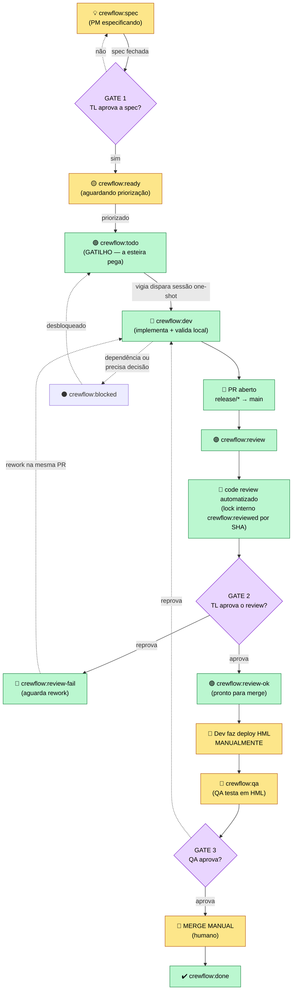

# Fluxo da esteira (KiroCrew Flow)

Orquestração de esteira de desenvolvimento sobre o **Kiro Crew**. Uma vigia
zero-token observa issues por label `crewflow:*` e, quando uma task está
priorizada, dispara uma **sessão de execução one-shot** que implementa e **abre o
PR** — uma passada, sem loop.

> **Regra inviolável: a automação NUNCA faz deploy.** Ela entrega o PR no estado
> `crewflow:review` e encerra (ou faz merge squash se `auto_merge_on_approve: true`
> estiver configurado no squad config). Deploy é sempre manual.
> Merge é **manual por padrão** (`auto_merge_on_approve: false`). Ative por squad
> config para habilitar merge squash automático após approve sem comentários.

## Fluxograma — Versão C (oficial: review ANTES do QA, sequencial)



## Labels — duas dimensões

O modelo é **estado × modificador**. Um estado por vez; zero ou mais modificadores
sobrepostos. **Modificador de parada tem prioridade sobre o estado.**

### Estados (1 por vez, ordem canônica)

| Label | Cor | Significado | Quem mexe |
|---|---|---|---|
| `crewflow:spec` | 🟡 `#FEF3C7` | PM especificando | 🔒 humano |
| `crewflow:ready` | 🟨 `#FBBF24` | spec pronta, aguardando priorização | 🧠 humano libera |
| `crewflow:todo` | 🟢 `#16A34A` | **gatilho — a esteira pega** | 🤖 esteira |
| `crewflow:dev` | 🔵 `#2563EB` | implementando + validando local | 🤖 esteira |
| `crewflow:review` | 🟣 `#8B5CF6` | PR aberto: 🤖 review + TL aprova (**ANTES do QA**) | 🤖 + 🧠 TL |
| `crewflow:qa` | 🔷 `#0EA5E9` | deploy HML manual + QA testa (**DEPOIS do review**) | 🧠 Dev + QA |
| `crewflow:done` | 🟩 `#22C55E` | concluído | — |

### Modificadores (0..N, sobrepõem)

| Label | Cor | Significado |
|---|---|---|
| `crewflow:blocked` | 🔴 `#DC2626` | bloqueado — **para tudo** (prioridade sobre o estado) |
| `crewflow:running` | 🟠 `#F97316` | trabalho em andamento no estado atual |
| `crewflow:review-ok` | 🟢 `#22C55E` | reviewer aprovou — pronto para merge (remove `crewflow:review`) |
| `crewflow:review-fail` | 🔴 `#DC2626` | reviewer reprovou — aguarda rework, **re-trabalho na mesma PR** (remove `crewflow:review`; teto: N rounds → NOTIFY_HUMAN tl) |
| `crewflow:reviewed` | ⚫ `#6B7280` | lock anti-loop **interno**: já analisado neste SHA (não é estado de resultado) |
| `crewflow:hml-bypass` | 🟧 `#C2410C` | **exceção auditada:** hotfix foi direto pra PRD sem HML — exige justificativa no comentário (o motor **bloqueia o merge** sem ela) |
| `crewflow:changes-requested` | 🟣 `#9333EA` | *(deprecada)* substituída por `crewflow:review-fail` — mantida apenas para retrocompatibilidade |
| `crewflow:conflito` | 🟠 `#F97316` | PR com conflito de merge ou base desatualizada — **cron de conflito resolve via rebase na mesma branch** |

> **Resultado do review, 1 label por vez.** Após o review a issue nunca carrega
> duas labels de review ao mesmo tempo: aprovado → `crewflow:review-ok`; reprovado
> → `crewflow:review-fail`; ao terminar o rework, volta para `crewflow:review`
> (singular). `crewflow:reviewed` permanece apenas como lock anti-loop interno.

### Tipo de fluxo (routing) e prioridade

`crewflow:feature` · `crewflow:bug` · `crewflow:hotfix` · `crewflow:debt`
`crewflow:p1` · `crewflow:p2` · `crewflow:p3`

**Gatilho único:** só `crewflow:todo` faz a esteira agir. Tudo antes dela é humano;
tudo depois do PR também.

## Como o motor dispara (arquitetura hexagonal)

O loop completo da Fase 1:

```
squads/*.yaml
    → SquadConfig.resolve_workflow(labels)  → template (feature/bug/hotfix/debt)
    → scan_candidates(config, provider, conn)  → zero token, SQLite cache
    → executor.decide(result, state_comment, squad)  → puro Python, sem I/O
    → deployment.run() executa a decisão:
        DISPATCH_DEV       → sessão one-shot (implementa + abre PR)
        DISPATCH_REVIEWER  → notifica que kiro-reviewer foi disparado
        DISPATCH_REWORK    → sessão dev de re-trabalho (pedidos do reviewer na mesma PR)
        DISPATCH_CONFLICT_RESOLVER → sessão de resolução de conflito (rebase na branch feat/issue-N)
        MARK_CONFLITO      → aplica crewflow:conflito na issue (PR com mergeable=CONFLICTING)
        NOTIFY_HUMAN       → avisa TL / Dev / QA pelo papel correto
        BLOCK              → notifica bypass sem justificativa
        REBRAND            → atualiza labels (GATE 0 do hotfix)
        SKIP               → silêncio
```

O scan usa cache SQLite por squad — compara o hash das labels atuais com o
armazenado. Se não mudou, a issue é ignorada. Token só gasto quando há resultado.

A sessão one-shot **nunca mergeia e nunca faz deploy**. Ela entrega o PR em
`crewflow:review` e encerra. Uma passada.

### Crons por estágio (recomendado — Fase 2+)

Em vez de um único cron monolítico (`run`), a esteira pode ser dividida em
**4 crons independentes**, cada um com log, intervalo e modelo isolados:

| Entrypoint | Estado alvo | Ação | Intervalo recomendado |
|---|---|---|---|
| `run_dev` | `crewflow:todo` | `DISPATCH_DEV` — implementa + abre PR | 600s (10 min) |
| `run_reviewer` | `crewflow:review` (sem `crewflow:reviewed`) | `DISPATCH_REVIEWER` — code review | 300s (5 min) |
| `run_merge` | `crewflow:review-ok` | `MERGE_PR` — merge squash | 120s (2 min) |
| `run_conflito` | `crewflow:review-fail` ou `crewflow:conflito` | `DISPATCH_REWORK` (re-trabalho pós-review) / `DISPATCH_CONFLICT_RESOLVER` (conflito de merge) | 300s (5 min) |

O modelo por estágio é configurável via `stage_models` na `deployment.config.yaml`:

```yaml
stage_models:
  dev:       "kirocrew"   # modelo mais forte para implementação
  reviewer:  "kirocrew"   # modelo mais rápido para review
  merge:     "kirocrew"   # leve (merge squash)
  conflito:  "kirocrew"   # modelo de implementação para re-trabalho
```

O entrypoint legado `run` ainda funciona e orquestra todos os 4 estágios em
sequência — útil para migração gradual ou modo de aviso (auto_dispatch=false).

## Lock anti-loop: `crewflow:reviewed`

`crewflow:reviewed` é hoje um lock **puramente interno** — não é um estado de
resultado de negócio. O resultado visível do review é expresso por
`crewflow:review-ok` (aprovado) ou `crewflow:review-fail` (reprovado).

Uma análise por SHA. O robô de review adiciona `crewflow:reviewed` depois de
comentar. Se a label já está lá, o executor ignora a issue. Quando o dev faz um
novo push, a label é removida e a próxima varredura dispara nova análise.

## Travas de segurança

- `auto_dispatch=false` por padrão (só avisa até você confiar).
- `max_concurrent` (default 2) — cap por número de issues em `crewflow:dev + running` no scan.
- `max_turns_per_task` — teto duro por sessão.
- Worktree isolado + ordem de nunca tocar outros worktrees/branches.
- **Nenhum deploy automatizado** — trava de produto, não de config.
- Merge squash automático é **opt-in** por squad config (`auto_merge_on_approve: true`); default é merge manual.

## Concorrência orientada ao estado da issue

A partir da Fase 2, **a issue é a fonte da verdade de concorrência** — não lock por tempo:

- **Mecanismo primário:** `_issue_has_active_session()` verifica estado real (worktree + PR + backstop curto)
- **Cap:** contagem de issues em `crewflow:dev + crewflow:running` no scan (não locks de arquivo)
- **Backstop curto (2min):** lock de arquivo só para anti-duplo-dispatch enquanto o label ainda não chegou na API
- **Detector de sessão morta:** `_is_dead_session()` — running há >40min sem PR, sem worktree e sem backstop → sessão morta
- **Recuperação fail-closed:** sessão morta remove `crewflow:running`, notifica TL, e espera redespacho humano — nunca redespacha sozinho se houver ambiguidade

> Depende do Kiro Crew rodando — é uma receita/plugin, não um app standalone.
