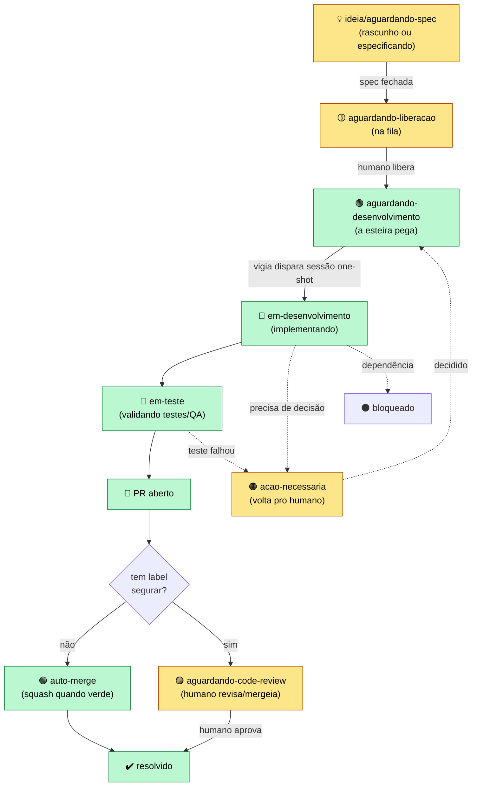

# Fluxo da esteira (kirocrew-deployment)

Esteira de desenvolvimento autônoma sobre o **Kiro Crew**. Uma vigia zero-token
observa issues por label e, quando uma issue está liberada, dispara uma **sessão
de execução one-shot** que implementa, abre PR e (se permitido) mergeia — uma
passada, sem loop.

## Fluxograma

## Labels (o vocabulário do fluxo)

| Label | Cor | Significado | Quem mexe |
|---|---|---|---|
| `ideia/aguardando-spec` | 🟡 `#FEF3C7` | ideia crua ou em especificação | 🔒 humano |
| `aguardando-liberacao` | 🟨 `#FBBF24` | spec pronta, na fila | 🧠 humano libera |
| `aguardando-desenvolvimento` | 🟢 `#16A34A` | **gatilho — a esteira pega** | 🤖 esteira |
| `em-desenvolvimento` | 🔵 `#2563EB` | sessão implementando | 🤖 esteira |
| `em-teste` | 🔷 `#0EA5E9` | validando (testes/QA) antes do PR | 🤖 esteira |
| `aguardando-code-review` | 🟣 `#8B5CF6` | PR aberto, esperando revisão | 🧠 humano |
| `acao-necessaria` | 🟠 `#F97316` | travou, precisa de decisão | 🤖→🧠 |
| `segurar` | 🔴 `#DC2626` | não fazer auto-merge (põe antes) | 🧠 humano |
| `bloqueado` | ⚫ `#374151` | travado por dependência | — |

**Gatilho único:** só `aguardando-desenvolvimento` faz a esteira agir. Tudo antes
dela é humano; o resto é a sessão.

## Como o motor dispara (sem loop, sem sandbox)

1. Cron de **script** (zero token) varre os repos por `aguardando-desenvolvimento`
   (ignora quem tem `em-desenvolvimento`).
2. Se `auto_dispatch=true` e há vaga (respeitando `max_concurrent` e 1-por-repo),
   faz um POST loopback interno pra `/api/chat` — cria uma sessão one-shot que roda
   o turno **in-process no gateway** (sem sandbox, sem watchdog).
3. A sessão usa um **worktree isolado** do clone local (não reclona, não bagunça),
   implementa, abre PR, mergeia (ou para em `segurar`/`acao-necessaria`), limpa as
   labels e **encerra**. Uma passada.

## Travas de segurança

- `auto_dispatch=false` por padrão (só avisa até você confiar).
- `max_concurrent` (default 2) e **1 sessão por repo** (evita colisão de merge).
- `max_turns_per_task` — teto duro por sessão.
- Worktree isolado + ordem de nunca tocar outros worktrees/branches.

> Depende do Kiro Crew rodando — é uma receita/plugin, não um app standalone.
