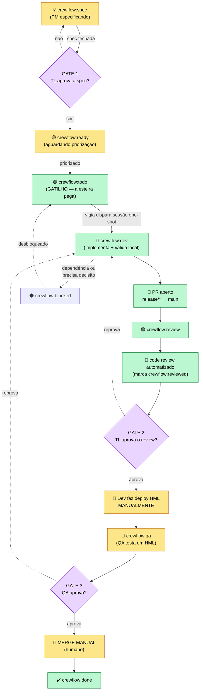

# Fluxo da esteira (KiroCrew Flow)

Orquestração de esteira de desenvolvimento sobre o **Kiro Crew**. Uma vigia
zero-token observa issues por label `crewflow:*` e, quando uma task está
priorizada, dispara uma **sessão de execução one-shot** que implementa e **abre o
PR** — uma passada, sem loop.

> **Regra inviolável: a automação NUNCA mergeia e NUNCA faz deploy.** Ela entrega
> o PR no estado `crewflow:review` e encerra. Merge e deploy são sempre manuais.
> Auto-merge opcional por squad está no radar (futuro), não na Fase 1.

## Fluxograma — Versão C (oficial: review ANTES do QA, sequencial)



## Labels — duas dimensões

O modelo é **estado × modificador**. Um estado por vez; zero ou mais modificadores
sobrepostos. **Modificador de parada tem prioridade sobre o estado.**

### Estados (1 por vez, ordem canônica)

| Label | Cor | Significado | Quem mexe |
|---|---|---|---|
| `crewflow:spec` | 🟡 `#FEF3C7` | PM especificando | 🔒 humano |
| `crewflow:ready` | 🟨 `#FBBF24` | spec pronta, aguardando priorização | 🧠 humano libera |
| `crewflow:todo` | 🟢 `#16A34A` | **gatilho — a esteira pega** | 🤖 esteira |
| `crewflow:dev` | 🔵 `#2563EB` | implementando + validando local | 🤖 esteira |
| `crewflow:review` | 🟣 `#8B5CF6` | PR aberto: 🤖 review + TL aprova (**ANTES do QA**) | 🤖 + 🧠 TL |
| `crewflow:qa` | 🔷 `#0EA5E9` | deploy HML manual + QA testa (**DEPOIS do review**) | 🧠 Dev + QA |
| `crewflow:done` | 🟩 `#22C55E` | concluído | — |

### Modificadores (0..N, sobrepõem)

| Label | Cor | Significado |
|---|---|---|
| `crewflow:blocked` | 🔴 `#DC2626` | bloqueado — **para tudo** (prioridade sobre o estado) |
| `crewflow:running` | 🟠 `#F97316` | trabalho em andamento no estado atual |
| `crewflow:reviewed` | ⚫ `#6B7280` | lock anti-loop: já analisado neste SHA |
| `crewflow:hml-bypass` | 🟧 `#C2410C` | **exceção auditada:** hotfix foi direto pra PRD sem HML — exige justificativa no comentário (o motor **bloqueia o merge** sem ela) |

### Tipo de fluxo (routing) e prioridade

`crewflow:feature` · `crewflow:bug` · `crewflow:hotfix` · `crewflow:debt`
`crewflow:p1` · `crewflow:p2` · `crewflow:p3`

**Gatilho único:** só `crewflow:todo` faz a esteira agir. Tudo antes dela é humano;
tudo depois do PR também.

## Como o motor dispara (arquitetura hexagonal)

O loop completo da Fase 1:

```
squads/*.yaml
    → SquadConfig.resolve_workflow(labels)  → template (feature/bug/hotfix/debt)
    → scan_candidates(config, provider, conn)  → zero token, SQLite cache
    → executor.decide(result, state_comment, squad)  → puro Python, sem I/O
    → deployment.run() executa a decisão:
        DISPATCH_DEV       → sessão one-shot (implementa + abre PR)
        DISPATCH_REVIEWER  → notifica que kiro-reviewer foi disparado
        NOTIFY_HUMAN       → avisa TL / Dev / QA pelo papel correto
        BLOCK              → notifica bypass sem justificativa
        REBRAND            → atualiza labels (GATE 0 do hotfix)
        SKIP               → silêncio
```

O scan usa cache SQLite por squad — compara o hash das labels atuais com o
armazenado. Se não mudou, a issue é ignorada. Token só gasto quando há resultado.

A sessão one-shot **nunca mergeia e nunca faz deploy**. Ela entrega o PR em
`crewflow:review` e encerra. Uma passada.

## Lock anti-loop: `crewflow:reviewed`

Uma análise por SHA. O robô de review adiciona `crewflow:reviewed` depois de
comentar. Se a label já está lá, o executor ignora a issue. Quando o dev faz um
novo push, a label é removida e a próxima varredura dispara nova análise.

## Travas de segurança

- `auto_dispatch=false` por padrão (só avisa até você confiar).
- `max_concurrent` (default 2) e **1 sessão por repo**.
- `max_turns_per_task` — teto duro por sessão.
- Worktree isolado + ordem de nunca tocar outros worktrees/branches.
- **Nenhum merge e nenhum deploy automatizados** — trava de produto, não de config.

> Depende do Kiro Crew rodando — é uma receita/plugin, não um app standalone.
